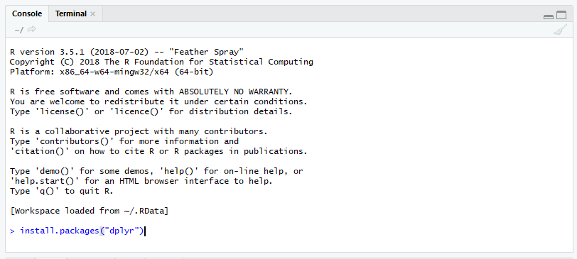

Un paquete es simplemente una colección de funciones, datos y código R. 


### Instalar la librería.
Para instalar una librería podemos hacerlo directamente desde la consola escribiendo:

```{r}
install.packages("dplyr")
```
Donde dplyr es el nombre de la libreria. 

 


### Cargar la librería.

Para utilizar las funciones que contiene la librería debemos cargarlo en memoria para poder usar las funciones en el espacio de trabajo.

Para cargar el paquete podemos escribir en la consola lo siguiente:

```{r}
library(dplyr)
```

 
 